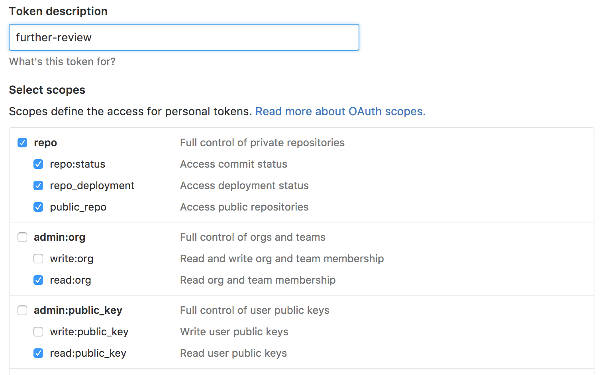

# (Upon) Further Review

[![Build Status][travis-badge]][travis-link]
[![Coverage Status][coveralls-badge]][coveralls-link]
[![Dependency Status][dependency-badge]][dependency-link]

**Further Review** enforces glob based code reviews on PRs.

* [Getting Started](#getting-started)
* [How it works](docs/how-it-works.md)
* [Providers](docs/providers.md)
* [Watch / Subscriptions only](#using-for-glob-based-watch--subscriptions)
* [Inspirations](#inspirations)

## Getting Started

There are a number of ways to use Further Review with your repo, but the easiest is to just add a **.further-review.yml** file similar to this example:

```yaml
reviews:
  - name: Package.json Maintainers
    # List of GitHub usernames
    logins:
      # All three of the following formats are supported:
      - paultyng
      - paultyng <paul@example.com>
      - Paul Tyng <paul@example.com> (@paultyng)
    # Optional glob to match on
    glob: package.json
    # Number of required sign offs
    required: 1
  # Multiple reviews can be listed.
  - name: General Maintainers
    logins:
      - user1
      - user2
```

Given the file above, when a new PR is submitted, at least one of **user1** or **user2** will need to sign off due to the `General Maintainers` rule, and if the PR touches the **package.json** file, **paultyng** would also need to sign off.

### Preliminary Setup

#### Github Access Token

Create a [personal access token](https://github.com/settings/tokens):


### Installation

#### Docker

```bash
> git clone git@github.com:underarmour/further-review.git
> cd further-review
> docker build .
> docker run --env GITHUB__TOKEN=<token> <image_id>
```

To run in Github Enterprise, use:

```bash
> docker run --env GITHUB__TOKEN=<token> --env GITHUB__BASE_URL=<api_path> <image_id>
```

#### Lambda

This application uses [Apex](http://apex.run) to run on AWS Lambda.  To deploy on Lambda:

1. Create an **env.json** file (`GITHUB_BASE_URL` defaults to public GitHub):

  ```json
  {
    "GITHUB_TOKEN": "YOUR ACCESS TOKEN HERE",
    "GITHUB_BASE_URL": "https://api.github.com/"
  }
  ```

1. Run `apex deploy -e env.json`

#### Setting up the Webhooks

> ##### Local Development Note
You'll need a tunnel or public ip for github to reach your hook.
If you don't have a public host, you can use a service like [ngrok](https://ngrok.com/).

A webhook should be configured in GitHub with the payload URL of
```
http://<host or ip from docker or Lambda>/github-webhook
```
with the following events:

* Issue comment
* Pull request
* Pull request review comment

### Additional Setup

#### Protecting the Branch

Further Review works best when the `master` branch is protected until it reviews the PR.  You can set this up in GitHub settings for the repo.


## Using for Glob based Watch / Subscriptions

To just subscribe to files for notification but not be required for review, you can add a targeted review with zero required sign-offs.

## Whitelisted Users / Tools

When using a tool that creates automatically managed PRs, such as Greenkeeper or Renovate, you may wish to bypass FR.

Use the `users_whitelist` config setting to provide a list of users.  If a PR is opened for a user in that list, the status check
will be marked as successful and the providers will not run against it.

```yaml
users_whitelist:
  - greenkeeper
  - renovate
reviews:
  - name: Package.json Maintainers
    # List of GitHub usernames
    logins:
      # All three of the following formats are supported:
      - paultyng
      - paultyng <paul@example.com>
      - Paul Tyng <paul@example.com> (@paultyng)
    # Optional glob to match on
    glob: package.json
    # Number of required sign offs
    required: 1
  # Multiple reviews can be listed.
  - name: General Maintainers
    logins:
      - user1
      - user2

```

## Inspirations

* [LGTM](https://lgtm.co)
* [Facebook's Mention Bot](https://github.com/facebook/mention-bot)

[travis-badge]: https://travis-ci.org/underarmour/further-review.svg?branch=master
[travis-link]: https://travis-ci.org/underarmour/further-review
[coveralls-badge]: https://coveralls.io/repos/github/underarmour/further-review/badge.svg?branch=master
[coveralls-link]: https://coveralls.io/github/underarmour/further-review?branch=master
[dependency-badge]: https://dependencyci.com/github/underarmour/further-review/badge
[dependency-link]: https://dependencyci.com/github/underarmour/further-review
